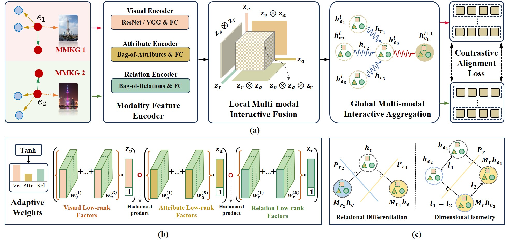

# LoginMEA

The code of paper _**LoginMEA: Local-to-Global Interaction Network for Multi-modal Entity Alignment**_ [[arxiv](https://arxiv.org/abs/2407.19625)] [[ECAI](https://ebooks.iospress.nl/doi/10.3233/FAIA240612)] in Proceedings of ECAI 2024.


<div align="center">
    
</div>

## Env

Run the following command to create the required conda environment:

```
conda env create -f environment.yml -n LoginMEA
```

## Datasets

### Cross-KG datasets

The original cross-KG datasets (FB15K-DB15K/YAGO15K) comes from [MMKB](https://github.com/mniepert/mmkb), in which the image embeddings are extracted from the pre-trained VGG16. We use the image embeddings provided by [MMKB](https://github.com/mniepert/mmkb#visual-data-for-fb15k-yago15k-and-dbpedia15k). Place `mmkb-datasets` directory  in the `data` directory.

### Bilingual datasets

The multi-modal version of DBP15K dataset comes from the [EVA](https://github.com/cambridgeltl/eva) repository, and the folder `pkls` of DBP15K image features should be downloaded according to the guidance of EVA repository, and the downloaded folder `pkls` is placed in the `data` directory of this repository.

## How to run script

```
bash run_mmkb.sh
```


## Citation

If you use this model or code, please cite it as follows:

```
@misc{LoginMEA,
      title={LoginMEA: Local-to-Global Interaction Network for Multi-modal Entity Alignment}, 
      author={Taoyu Su and Xinghua Zhang and Jiawei Sheng and Zhenyu Zhang and Tingwen Liu},
      year={2024},
      eprint={2407.19625},
      archivePrefix={arXiv},
      primaryClass={cs.CL},
      url={https://arxiv.org/abs/2407.19625}, 
}
```


## Acknowledgement

We appreciate [MCLEA](https://github.com/lzxlin/MCLEA), [MEAformer](https://github.com/zjukg/MEAformer), [UMAEA](https://github.com/zjukg/umaea), [MSNEA](https://github.com/liyichen-cly/MSNEA), [EVA](https://github.com/cambridgeltl/eva), [MMEA](https://github.com/liyichen-cly/MMEA), [XGEA](https://github.com/LoveBigAI/XGEA),  and many other related works for their open-source contributions.
